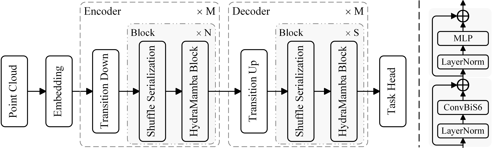

<div align="center">

# HydraMamba: Multi-Head State Space Model for Global Point Cloud Learning

</div>

## Abstract
The attention mechanism has become a dominant operator in point cloud learning, but its quadratic complexity leads to limited inter-point interactions, hindering long-range dependency modeling between objects. Due to excellent long-range modeling capability with linear complexity, the selective state space model (S6), as the core of Mamba, has been exploited in point cloud learning for long-range dependency interactions over the entire point cloud. Despite some significant progress, related works still suffer from imperfect point cloud serialization and lack of locality learning. To this end, we explore a state space model-based point cloud network termed HydraMamba to address the above challenges. Specifically, we design a shuffle serialization strategy, making unordered point sets better adapted to the causal nature of S6. Meanwhile, to overcome the deficiency of existing techniques in locality learning, we propose a ConvBiS6 layer, which is capable of capturing local geometries and global context dependencies synergistically. Besides, we propose MHS6 by extending the multi-head design to S6, further enhancing its modeling capability. HydraMamba achieves state-of-the-art results on various tasks at both object-level and scene-level.

## Overview

<div align="center">



</div>

## Install

This codebase was tested with the following environment configurations. It may work with other versions.
- Ubuntu 22.04
- CUDA 11.8
- Python 3.8
- PyTorch 2.0.0 + cu118

We recommend using Anaconda for the installation process:
```shell 
# Clone the repository
$ git clone https://github.com/Point-Cloud-Learning/HydraMamba.git
$ cd HydraMamba

# Create virtual env and install PyTorch
$ conda create -n HydraMamba python=3.8
$ conda activate HydraMamba
(HydraMamba) $ conda install pytorch==2.0.0 torchvision==0.15.0 torchaudio==2.0.0 pytorch-cuda=11.8 -c pytorch -c nvidia

# Install basic required packages
(HydraMamba) $ pip install -r requirements.txt

# PointNet++
(HydraMamba) $ pip install pointnet2_ops_lib/.
```

Usage
```shell
python main.py --config_path Configurations/ModelNet40.yaml --train True
```

## Acknowledgement

This project is based on Mamba ([paper](https://arxiv.org/abs/2312.00752), [code](https://github.com/state-spaces/mamba)), 
Causal-Conv1d ([code](https://github.com/Dao-AILab/causal-conv1d)), 
PointMamba([paper](https://arxiv.org/abs/2402.10739), [code](https://github.com/LMD0311/PointMamba)). 
PCM([paper](https://arxiv.org/abs/2403.00762), [code](https://github.com/SkyworkAI/PointCloudMamba)).
Mamba3D([paper](https://arxiv.org/abs/2404.14966), [code](https://github.com/xhanxu/Mamba3D)). 
Thanks for their wonderful works.

## Citation

If you find this repository useful in your research, please consider giving a star ⭐ and a citation
```BibTeX
@Inproceedings{HydraMamba,
  author =       "K. L. Qu and P. Gao and Q. Dai and Y. H. Sun",
  title =        "HydraMamba: Multi-Head State Space Model for Global Point Cloud Learning",
  booktitle =    "Proc. ACM International Conference on Multimedia (ACM MM)",
  address =      "Dublin, Ireland",
  year =         2025
}
```

## LICENSE

PointMLP is under the Apache-2.0 license. 
